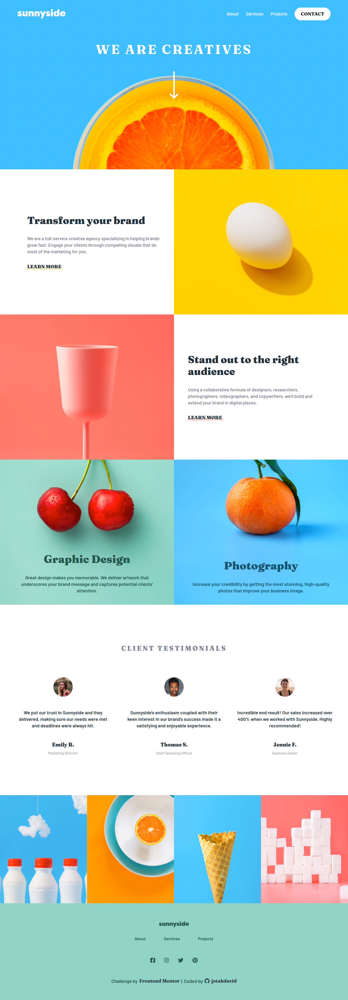

# Frontend Mentor - Sunnyside Agency

---

## Welcome! :wave:

This is a solution to the [Sunnyside Agency page challenge on Frontend Mentor](https://www.frontendmentor.io/challenges/sunnyside-agency-landing-page-7yVs3B6ef).
Frontend Mentor challenges help you improve your coding skills by building realistic projects.

## Overview

### The challenge

Users should be able to:

- View the optimal layout for the site depending on their device's screen size
- See hover states for all interactive elements on the page

### Links

- Live Site URL: [GitHub Pages](https://jotahdavid.github.io/sunnyside-agency-landing-page/)

## My process

### Built with

- Semantic HTML5 markup
- CSS modules
- CSS variables
- Flexbox

### Screenshot

